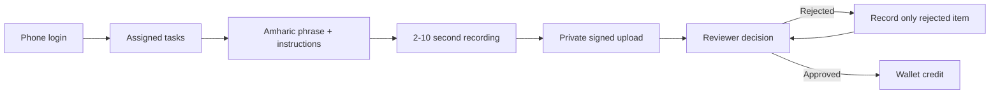

# Mahder E2E Stabilization Report — Mobile

## 1. Executive summary

The contributor app now matches the production API contracts, refreshes expired
sessions correctly, builds an installable universal Android APK, and adapts the
task experience for compact phones and emulators.

## 2. Mobile workflow illustration



## 3. What was improved

- Aligned refresh-token endpoint, request field, and nested token response.
- Removed unsupported submission fields while preserving audio metadata.
- Read task details from `contributorMicroTask` and retained deadline
  compatibility.
- Pointed release builds at the production HTTPS API.
- Updated Gradle, Android Gradle Plugin, Kotlin, and Java targets for the current
  Flutter toolchain.
- Produced an installable universal APK with ARM32, ARM64, and x86-64 libraries.
- Used the scrollable task layout below 700 logical pixels.
- Scaled the empty-task illustration to eliminate compact-screen overflow.

## 4. Compact-screen illustration

Before:

```text
Fixed-height content + recording controls + keyboard
                         ↓
                 bottom overflow / hidden controls
```

After:

```text
Screen height < 700px
        ↓
Scrollable phrase, submission and recording controls
        ↓
Controls remain reachable with keyboard/recording states
```

## 5. Verification performed

- `flutter test`: 22/22 tests passed.
- Compact threshold test verifies 640px and 699px use the small layout while
  700px uses the normal layout.
- Debug APK built and ran on `emulator-5554` at 320x640.
- Empty-task screen rendered without a RenderFlex overflow.
- Universal release APK architecture contents were verified.
- `flutter analyze` retains existing repository warnings/information findings;
  no new blocking compile issue was introduced.

## 6. Known limitations

- OneSignal push remains disabled until private production configuration exists.
- Final microphone, keyboard-open, retry, and wallet evidence must be captured
  during the fresh four-phrase manual workflow.

---

## 7. Pull request — copy/paste

### PR title

```text
fix: stabilize Android release and compact contributor E2E flow
```

### PR target

```text
main
```

### PR description

#### Summary

Stabilizes the Mahder contributor app for production authentication, task
submission, universal Android distribution, and compact-screen usage.

#### Main changes

- Align mobile submission and refresh-token requests with backend contracts.
- Parse contributor task details and deadlines from current API responses.
- Update Android build tooling and Java/Kotlin targets.
- Support installable release builds with or without a private local keystore.
- Use the production HTTPS API and require HTTPS for release traffic.
- Switch compact task screens to the scrollable layout below 700px.
- Prevent the empty task state from overflowing on a 320x640 screen.
- Add deterministic API, refresh, widget, and screen-threshold tests.

#### Verification

- `flutter test` passed: 22/22 tests.
- Debug APK build passed.
- Universal release APK contains ARM32, ARM64, and x86-64 libraries.
- Emulator verification passed at 320x640 without layout overflow.

#### Safety notes

- No signing keys, passwords, or environment files are included.
- OneSignal remains disabled without production credentials.
- External withdrawals remain disabled.
